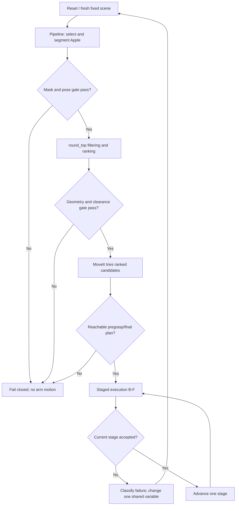

# Apple 稳定抓取与全物品推广实施方案

## 0. 文档状态

本文档用于方案审核，不授权直接执行机械臂运动。

当前子项目是：在固定场景、固定 Apple 槽位下，实现 `round_top` 类别代表物
`apple` 的稳定抓取、抬升、放置与释放。长期目标是逐步推广到五个类别的全部
18 个物品，并最终取消固定位置。

相关基础文档：

- `2026-07-12-round-top-grasp-category-design.md`
- `2026-07-12-round-top-fact-finding.md`
- `2026-07-13-fixed-grasp-category-representatives-design.md`
- `2026-07-13-hammer-safe-slot-design.md`

## 1. 最终目标与分解原则

最终目标不是让每个物品分别依赖一套特例参数偶然成功，而是形成一套按类别
复用、遇到未知或不安全状态会停止、能够用重复实验验证的抓取系统。

采用三层递进路线：

1. **类别代表物稳定**：五个类别各选一个代表物，在固定位置完成稳定闭环。
2. **类别内部全覆盖**：保持位置固定，用相同类别规则覆盖该类其他物品。
3. **位置随机化**：依次引入离散位置、随机 yaw、连续位置以及全场景随机化。

每一层只引入一个主要新变量。上一层未通过时，不进入下一层。

## 2. 五类对象与当前状态

| 类别 | 抓取 profile | 代表物 | 类内物品 | 当前状态 |
| --- | --- | --- | --- | --- |
| `cylindrical_can` | `side` | `tomato_soup_can` | tomato、tuna | tomato 暂按已通过处理，后续持续回归 |
| `round_top` | `round_top` | `apple` | 六种水果、三种球 | 当前子项目 |
| `box` | `vertical` | `foam_brick` | pudding、gelatin、sponge、foam、Rubik's cube | 待验证 |
| `banana` | `centered` | `banana` | banana | 待验证 |
| `tool_top` | `top_down` | `hammer` | hammer | 待验证 |

当前固定场景包含：

1. `tomato_soup_can`
2. `banana`
3. `apple`
4. `foam_brick`
5. `hammer`
6. 一个从剩余物品池中抽取的随机物品

六个位置仍固定。hammer 使用已验证的第五槽位
`[-0.55, 0.30, 0.0]`，避免与 banana 初始碰撞。

## 3. Apple 当前技术基线

### 3.1 已完成的离线事实测量

- Apple 几何中心：`[0.000859, -0.003784, 0.035552] m`
- Apple 包围盒：`[0.075448, 0.074871, 0.071889] m`
- 有效夹爪内部开口：约 `0.08516 m`
- Apple 需求宽度：约 `0.07487 m`
- 开口余量：约 `0.01029 m`，超过 5 mm 分阶段实验门槛
- Apple 抓取库：`/home/ws/grasps/013_apple`
- 原始候选数：5,013
- 满足 20° 垂直接近条件的候选数：1,382
- 保守 TCP 到最低活动手指 Z：`-0.104 m`

结论：Apple 不缺垂直候选，夹爪理论开口也足够。当前问题应通过分阶段实验定位，
不能先假定需要 Apple 专用候选生成或专用参数。

### 3.2 已存在的共享实现

当前代码已经具备：

- `GRASP_CATEGORY_BY_OBJECT` 与 category-to-profile 映射；
- 未知物品 fail closed；
- `round_top` 静态几何数据；
- 45° 几何中心对称扩展与去重；
- 垂直接近、中心偏移、归一化高度、宽度和桌面间隙过滤；
- 最多八个候选的排序输出；
- MoveIt 多候选依次尝试；
- pregrasp、final grasp、close、lift、release 前后的调试停止门；
- 终点 TCP 收敛检查；
- 5 秒主动抬升保持；
- 场景感知安全放置与失败释放保护。

因此 Apple 项目首先是验证和闭环稳定化项目，不是从零重写 selector。

## 4. 核心设计原则

### 4.1 禁止 Apple 行为特例

允许存在 Apple 的静态几何数据和 YCB 抓取库映射，但不允许新增如下逻辑：

```python
if object_name == "apple":
    # Apple 专用行为
```

如果 Apple 暴露 selector、planner 或 executor 问题，应修正共享 `round_top` 或公共
执行逻辑，并回归 tomato 与已有 round-top 测试。

### 4.2 硬安全条件必须过滤

下列条件不能只作为评分惩罚：

- 接近角度；
- 几何中心偏移；
- 夹爪开口；
- 最低手指桌面间隙；
- 非目标物体接近通道；
- final TCP 收敛；
- release 是否真正打开。

任何硬条件不满足时，必须在夹爪闭合前停止。

### 4.3 一次只调整一个主要变量

每次实验必须记录唯一主要改动，例如：

- 感知选择修复；
- 某个共享 `ROUND_TOP_*` 阈值；
- final approach 速度或收敛；
- 夹爪闭合策略；
- 抬升保持或释放策略。

禁止同时调整姿态高度、Z offset、速度、夹爪位置和放置位置后再用一次结果判断。

### 4.4 每次 reset 后必须使用新鲜感知

reset、相机移动或调试停止后的下一次实验，都必须重新运行 `pipeline`。不能把旧
`pose_result.json` 与新的相机 TF 组合。

## 5. 系统数据流与安全门



## 6. Apple 稳定抓取验收定义

Apple 代表物通过必须同时满足：

1. 固定第三槽位；其他五个物体使用当前场景规则。
2. 先逐项通过 A–F 分阶段安全验证。
3. 随后连续完成 2 次完整闭环：
   `reset -> fresh perception -> grasp -> lift/hold -> safe place -> release`。
4. 两次过程中无需人工修改目标、候选或机器人姿态。
5. 不能碰倒、推出桌面或明显移动其他物体。
6. Apple 在 5 秒保持中不掉落、不持续下滑。
7. release 必须真正达到打开位置，Apple 稳定留在桌面。
8. 任意一次失败后，连续成功计数归零。

每次完整试验的第六个随机物品必须记录。它不改变 Apple 固定位置，但可用于发现
接近通道或安全放置对背景物体的敏感性。

## 7. 指标与试验记录

每次试验至少保存以下字段：

| 组别 | 必须记录的内容 |
| --- | --- |
| 场景 | trial ID、Git commit/diff、容器名、随机第六物品、槽位、时间 |
| 感知 | instruction、选中名称、mask 数量/索引、bbox、pose 文件时间、相机 TF |
| pose | Apple geometry center world、仿真真值、位置误差、姿态/局部 +Z |
| selector | raw/expanded/oriented/center/height/width/table/selected 数量 |
| candidate | 序号、角度、中心偏移、归一化高度、宽度余量、手指间隙 |
| planning | 每个候选的 MoveIt 结果、最终采用候选、pregrasp/final target |
| execution | 实际 TCP、位置误差、命令次数、超时原因 |
| gripper | target、actual、effort、stalled、reached_goal、action status |
| retention | lift 高度、保持时间、Apple 相对 TCP 位移/是否滑落 |
| placement | 选择的 XY、与障碍距离、release TCP Z、`GRASP_DROP_RELEASE_Z_OFFSET`、打开结果 |
| result | 成功/失败、失败阶段、直接原因、下一步唯一改动 |

推荐为每次试验保存一个结构化 `trial_manifest.json` 和完整 stdout 日志。已有 JSON、
overlay 和日志仍保留，不用只依赖截图回忆。

## 8. 分阶段实施步骤

### Phase 0：冻结基线并完成离线回归

#### 目的

确认活动容器运行的是当前 `grasp_stable` 源码，所有已有共享能力通过测试，避免把
旧 binary、旧 perception 或另一仓库的代码误当成新结果。

#### 操作

1. 在活动仓库记录 `git status`、`git diff` 和当前分支。
2. 确认 Dev Container 挂载
   `E:\IFL\ros2-docker-workspace-vscode-plmrs-grasp-stable` 到 `/home/ws`。
3. 运行 scene、selector、planner、trajectory、executor 和 gripper focused tests。
4. `colcon build --packages-select my_course_pkg --symlink-install`。
5. 确认 Apple mesh、XML、抓取库真实存在。
6. 确认 `/moveit2_iface` 和 `/arm/state/current_pose` publisher 健康；这一步只检查，
   不执行运动。

#### 通过条件

- focused tests 全部通过；
- build 通过；
- source/install 指向当前活动仓库；
- Apple geometry 与 fact-finding 数值一致；
- tomato 相关回归无新增失败。

#### 失败处理

先修复构建、环境或测试基线，不进入 live 阶段。

### Phase A1：Apple 感知验证，不调用 MoveIt

#### 允许动作

- reset 仿真；
- 相机采集；
- LLM/SAM2/FoundationPose；
- 读取 ROS scene truth 和输出文件。

#### 禁止动作

- 不运行 `grasp_demo`；
- 不调用 MoveIt 规划或执行；
- 不发送夹爪命令。

#### 操作

1. reset 并等待全部物体稳定。
2. 运行 `ros2 run my_course_pkg pipeline`。
3. 输入明确指令：`pick up the apple`。
4. 检查 `selected_object.json` 确认名称为 `apple`。
5. 检查候选 overlay、selected mask metadata 和 mask bbox。
6. 确认没有 stale `pose_result.json`；失败时应生成 `pose_error.json` 或无 pose。
7. 将 FoundationPose Apple geometry center 转到 world，并与
   `/scene_description` 或 MuJoCo 真值比较。
8. 记录 FoundationPose 输出的 roll/pitch、局部 `+Z` 方向及两次 capture 间的变化。
   Apple/round-top 的 yaw 因近似旋转对称可以不作为稳定性判据，但姿态漂移仍可能通过
   非零局部 geometry-center offset 引入 world-frame Z 偏差。
9. 连续做 2 次独立 reset + fresh capture。

#### 通过条件

- 两次均选中唯一正确 Apple mask；
- 不需要手动 `FOUNDATIONPOSE_MASK_INDEX` 才能正常通过；
- 每次 pose 文件属于当前 capture；
- geometry center 三维误差不超过 `10 mm`；
- roll/pitch、局部 `+Z` 和 geometry-center Z 在两次 capture 间没有无法解释的跳变；
- 没有把其他圆形水果/球误认为 Apple。

#### 失败处理

- 目标名称错误：修复 LLM/object alias，不改 grasp 参数。
- mask 错误或多 mask：修复安全选择/验证器，不执行机械臂。
- geometry-center 位置误差持续大于 `10 mm`，尤其是 Z 误差时：首先检查 capture-time
  camera TF、camera-to-base 标定、桌面/基座 frame 真值以及 FoundationPose 对近似球形物体的
  姿态漂移。不得绕过 geometry center，也不得调整 selector 阈值或 grasp Z offset 掩盖误差。
- 只有测量证据证明 round-top 对称姿态需要规范化时，才允许设计类别级 canonicalization；
  禁止添加 Apple 专用姿态补偿。

### Phase A2：只读 selector 与候选报告

#### 允许动作

- 读取当前 perception 输出；
- 加载真实 Apple grasp library；
- 运行纯 selector、生成候选报告和可视化。

#### 禁止动作

- 不创建 arm action client；
- 不做 MoveIt 规划；
- 不执行机械臂或夹爪命令。

#### 检查项

1. category 必须是 `round_top`，profile 必须是 `round_top`。
2. grasp library 必须是 `013_apple`。
3. 输出每一级过滤数量和最终最多 8 个候选。
4. 对每个候选报告：
   - world-down 接近角 `<= 20°`；
   - geometry-center TCP-plane offset `<= 10 mm`；
   - normalized height 位于 `[0.0, 0.20]`；
   - estimated width `<= 85.16 mm`；
   - opening margin `>= 5 mm`；
   - 应用 `GRASP_Z_OFFSET` 后 finger clearance `>= 5 mm`。
5. 检查候选可视化是否位于 Apple 中心上方，而不是 YCB 原点上方。

#### 通过条件

- 至少一个候选通过全部硬过滤；
- 期望正常输出 8 个候选；少于 8 个必须解释过滤原因，但不自动放宽阈值；
- 所有最终候选满足上述硬阈值；
- selector exhaustion 会在任何 arm/gripper 动作前失败。

### Phase A3：规划验证，不执行轨迹

#### 目的

验证多个 round-top 候选到 pregrasp 和 final grasp 的 MoveIt 可达性，并提前发现
机器人自身、桌面或非目标物体的通道问题。

#### 必需能力

- planner 对候选逐个尝试；
- 第一个候选不可达时继续下一个；
- 所有候选失败时返回结构化原因；
- 对 Apple 垂直接近通道检查桌面、机器人和非目标物体。

#### 强制实现前置条件

当前 `_filter_results_by_side_approach_clearance()` 对任何非 `side` profile 直接返回，且
`_approach_clearance_violation()` 内部写死 `SIDE_GRASP_APPROACH_*` 参数。开始任何 A3 通过判定、
更不能进入 Phase B 实际运动之前，必须先完成以下共享改造：

1. 将 `_approach_clearance_violation()` 参数化，使 corridor radius、clearance margin 和
   vertical margin 由调用方/profile 配置传入；不得把 side 参数直接套用到 round-top。
2. 将 side-only filter 泛化为 profile-independent approach-clearance filter，移除“非 side
   直接放行”的路径，并让 `side` 与 `round_top` 都显式选择各自的 corridor 配置。
   `round_top` 配置值应根据 TCP 到夹爪/手指最外侧碰撞几何的 swept envelope 和场景位姿
   不确定性保守计算，不以“让 Apple 当前槽位通过”为调参目标。
3. `round_top` 必须检查从 pregrasp 到 final grasp 的完整直线段与所有非目标场景障碍；
   桌面、机器人自身和底座仍由 MoveIt collision planning 共同验证。
4. A3 依赖当前 `/scene_description`。场景描述缺失、过期或无法构建障碍集合时必须
   fail closed，不得用 `obstacles is None` 放行 round-top 候选；应区分“成功加载且没有
   非目标障碍”的空列表与“场景加载失败”的 `None`。
5. 不添加 Apple 名称分支；该能力属于共享 planner，并将复用于其他 round-top 物品和
   后续随机位置阶段。

实现后必须先增加离线 planner 测试：round-top 近障碍拒绝、远障碍保留、场景缺失时
fail closed，以及已有 side-grasp corridor 行为不变。以上测试通过前，不运行 A3 live planning，
也不进入 Phase B。

#### 通过条件

- 至少一个候选同时拥有 pregrasp 和 final approach 可行计划；
- approach corridor 没有与其他五个物体或机器人底座重叠；
- 规划阶段不执行轨迹、不闭合夹爪。

### Phase B：移动到 pregrasp 后停止

#### 配置

```bash
export GRASP_DEBUG_STOP_AT_PREGRASP=1
unset GRASP_DEBUG_STOP_AT_GRASP
unset GRASP_DEBUG_STOP_AFTER_CLOSE
unset GRASP_DEBUG_STOP_AFTER_LIFT
unset GRASP_DEBUG_STOP_BEFORE_RELEASE
```

#### 操作

1. reset；
2. fresh pipeline for Apple；
3. 人工复核 mask、pose 和 A2/A3 报告；
4. 启动 `grasp_demo`；
5. 到达 pregrasp 后保持，不进行 approach、close、lift 或 place。

#### 通过条件

- TCP 位于 final target 上方的预期 approach 距离；
- 手指完全张开；
- Apple 位于两指中心线下方；
- 直线下降通道没有桌面、机器人或其他物体；
- actual TCP 与 pregrasp target 的误差在规划/控制容差内。

#### 失败处理

- MoveIt 不可达：先分析候选排序或机器人运动学，不修改 perception。
- 通道不安全：修复共享 vertical corridor gate 或选择下一个候选。

### Phase C：下降到 final grasp，保持夹爪打开

#### 配置

```bash
unset GRASP_DEBUG_STOP_AT_PREGRASP
export GRASP_DEBUG_STOP_AT_GRASP=1
export GRASP_FINAL_APPROACH_POSITION_TOLERANCE_M=0.010
```

现有共享默认值是 `13 mm`（`0.013 m`）。Apple 首次闭合前明确采用更严格的 `10 mm`
（`0.010 m`）final position gate，而不是沿用默认值。不得把 Apple 实验容差提高到默认值
以上；若共享 servo 不能收敛到 `10 mm`，应修复收敛逻辑或选择更可达候选，而不是放宽
安全门。任何后续容差调整都必须有测量记录，并且绝不超过共享默认 `13 mm`。

#### 通过条件

- final actual TCP 总位置误差 `<= 10 mm`；
- 两指在 Apple 两侧且没有提前撞到 Apple 顶部；
- 最低手指与桌面至少保留 `5 mm` 计算间隙；
- Apple 在夹爪未闭合时没有被明显推动；
- 没有执行 close、lift、place 或 release。

#### 失败处理

- final 误差大：修复收敛/控制，不用负 Z offset 补偿控制误差。
- 双指不居中：区分 perception center、geometry center 和候选 center 问题。
- 提前碰撞 Apple 顶部：检查接近角、finger geometry 与 candidate height。

### Phase D：闭合后停止，不抬升

#### 配置

```bash
unset GRASP_DEBUG_STOP_AT_GRASP
export GRASP_DEBUG_STOP_AFTER_CLOSE=1
```

#### 通过条件

- close 命令实际发送；
- `GripperCommandResult` 完整记录；
- stalled contact 只有在实际形成双侧 Apple 接触时才可接受；
- Apple 位于双指之间，没有单侧挤出或明显滚动；
- Apple geometry center 位移不超过 `10 mm`；
- 不执行 lift、transfer、place 或 release。

#### 失败处理

- 过早单侧 stalled：检查 final centering 和 closing axis，不盲目加大闭合命令。
- Apple 被推出：检查 final TCP 偏差、候选高度和两指对称性。
- 夹爪到达完全闭合但未接触：说明漏抓，必须失败。

### Phase E：抬升 0.2 m 并主动保持 5 秒

#### 配置

```bash
unset GRASP_DEBUG_STOP_AFTER_CLOSE
export GRASP_DEBUG_STOP_AFTER_LIFT=1
```

#### 通过条件

- Apple 随夹爪抬升，实际上升至少 `0.15 m`；
- 5 秒保持期间不掉落；
- Apple 相对 TCP 没有持续滑移，总相对位移不超过 `10 mm`；
- 机器人和 Apple 不接触其他物体或桌面；
- 不执行 transfer/place/release。

#### 失败处理

- 立即掉落：优先检查闭合接触与 grasp height。
- 缓慢滑落：检查夹持法向、摩擦、闭合位置和球形表面接触，不先改变 lift 轨迹。
- Apple 被夹住但 lift 失败：检查 planner/executor，不修改 selector。

### Phase F1：放置前停止

#### 配置

```bash
unset GRASP_DEBUG_STOP_AFTER_LIFT
export GRASP_DEBUG_STOP_BEFORE_RELEASE=1
```

#### 通过条件

- safe placement 使用当前 `/scene_description`；
- selected placement 位于配置边界内、机器人底座排除区外；
- 与所有非目标物体满足配置的 clearance；
- release TCP Z 根据成功 grasp TCP 推导，并显式记录最终
  `GRASP_DROP_RELEASE_Z_OFFSET`（默认 `0.0 m`）；
- Apple 已接近桌面但夹爪尚未打开；
- 没有自由落体式放置。

### Phase F2：完整释放与撤离

#### 配置

```bash
unset GRASP_DEBUG_STOP_BEFORE_RELEASE
```

解除 debug stop 后仍必须保留现有执行保护链：`gripper_control.py` 的
`_gripper_result_accepted()` 对 open command 只接受
`actual_position <= GRIPPER_OPEN_MAX_POSITION`；`executor.py` 的
`_validate_gripper_result()` 再对 `open_gripper_to_release` 验证真正打开。任一判定失败时，
executor 都应抛出 `GripperCommandError`，终止当前 plan，使后续 retreat 和
return-to-initial 不会执行。
`VerifyInitPoseNode` 只用于成功执行后的 return-to-initial joint goal 构建，不是 release gate，
不得把它当作释放成功判据。

#### 通过条件

- release 命令达到真正打开位置，不能只因 stalled 就判成功；
- Apple 稳定停留在桌面，没有滚出安全区域；
- Apple 释放后等待至少 2 秒再判定；
- retreat 不再次碰撞 Apple；
- 其他物体没有明显移动。

### Phase G：连续两次完整闭环验收

每次 trial 都必须从 reset 和 fresh pipeline 开始。禁止复用上一次的 perception 文件。

| Trial | 随机第六物品 | Mask/Pose | 候选 | Final error | Close | Lift hold | Place/release | 结果 |
| --- | --- | --- | --- | ---: | --- | --- | --- | --- |
| 1 | 记录 | 记录 | 记录 | 记录 | 记录 | 记录 | 记录 | 待执行 |
| 2 | 记录 | 记录 | 记录 | 记录 | 记录 | 记录 | 记录 | 待执行 |

任意 trial 失败：

1. 立即停止连续计数；
2. 保存现场和日志；
3. 按第 10 节分类；
4. 只修复一个主要原因；
5. 从相关的最早安全阶段重新验证；
6. 再从 trial 1 开始累计。

## 9. 自动化测试与代码边界

### 9.1 必须长期保留的测试

- category/profile 映射与未知物体 fail closed；
- Apple/round-top orientation、symmetry、center、height、width、table filters；
- 应用 later world-Z offset 后的 table clearance；
- 多候选排序和 fallback；
- 候选耗尽时不产生 close step；
- pregrasp/final/after-close/after-lift/before-release 调试停止；
- final convergence 失败不闭合；
- stalled-but-not-open release 失败；
- round-top 垂直接近通道近障碍拒绝、远障碍保留、缺失场景 fail closed；
- side-grasp 接近通道在共享重构后行为不变；
- tomato side-grasp 回归；
- 固定场景五类别代表物与 hammer 安全槽位。

### 9.2 后续可新增的诊断与验收自动化

- Apple perception geometry center 与仿真真值比较工具；
- 结构化 trial manifest 完整性；
- close 后漏抓、单侧接触与有效双侧接触的结果分类；
- lift hold 中目标未随 TCP 上升时 fail closed。

### 9.3 文件职责

| 文件/模块 | 允许承担的职责 |
| --- | --- |
| `grasp/config.py` | 共享 round-top 参数、静态 geometry、调试门 |
| `grasp/grasp_selector.py` | 纯几何过滤、评分、多候选和诊断 |
| `grasp/pick_place_planner.py` | TF、MoveIt、场景障碍、接近通道、安全放置 |
| `grasp/executor.py` | 分阶段执行、收敛、gripper result、失败停止 |
| `test_grasp_selector.py` | selector 纯逻辑与真实库离线验证 |
| planner/executor tests | fallback、无危险继续、调试停止和释放保护 |

不得把 perception 误差补偿放入 selector，也不得把 grasp 几何判断放入 executor。

## 10. 失败决策表

| 现象 | 归属层 | 首先检查 | 禁止的错误补偿 |
| --- | --- | --- | --- |
| 选到其他水果/球 | perception | instruction、mask candidates、verifier | 调 grasp offset |
| Apple pose 与真值偏离 | perception/TF | capture timestamp、camera TF、mask | 用 Z offset 掩盖 |
| 无候选 | selector | 各级 filter count、geometry、table Z | 一次放宽全部阈值 |
| 候选有但都不可达 | planner | candidate order、IK、pregrasp | 改 perception |
| final TCP 到不了 | control/executor | convergence、servo、速度 | 放宽到危险容差 |
| final 到了但双指偏心 | pose/selector | geometry center、TCP target | 盲目加闭合力 |
| close 后 Apple 滚出 | grasp contact | final error、height、closing axis | 立即尝试 full run |
| lift 时掉落 | grasp retention | contact、friction、slip | 先改放置轨迹 |
| 放置时抛出/滚走 | placement/release | release TCP Z、`GRASP_DROP_RELEASE_Z_OFFSET`、hold、open result | 关闭 release gate |
| 其他物体被撞 | planner/scene | corridor、obstacles、placement | 继续下一个阶段 |

## 11. 推荐命令框架

### 11.1 启动仿真与 MoveIt

```bash
cd /home/ws
source /opt/ros/humble/setup.bash
source install/setup.bash
ros2 launch ifl_air_ur_launch cell_small_full_mujoco_moveit.launch.py
```

### 11.2 reset 与 fresh perception

```bash
ros2 service call /reset_sim std_srvs/srv/Trigger {}

cd /home/ws
source /opt/ros/humble/setup.bash
source install/setup.bash
ros2 run my_course_pkg pipeline
# Instruction: pick up the apple
```

### 11.3 调试执行通用前置

```bash
cd /home/ws
source /opt/ros/humble/setup.bash
source install/setup.bash
unset ROS_DOMAIN_ID
export PYTHONUNBUFFERED=1
```

每个阶段只启用该阶段对应的一个 debug stop，其他 stop 必须显式 `unset`。

### 11.4 focused tests

```bash
cd /home/ws
source /opt/ros/humble/setup.bash
source install/setup.bash
export PYTEST_DISABLE_PLUGIN_AUTOLOAD=1

python3 -m pytest \
  src/my_course_pkg/test/test_grasp_selector.py \
  src/my_course_pkg/test/test_pick_place_planner.py \
  src/my_course_pkg/test/test_grasp_executor_gripper_failures.py \
  src/my_course_pkg/test/test_trajectory_planner.py -q

PYTHONPATH=src/ifl_air_mujoco_sim python3 -m pytest \
  src/ifl_air_mujoco_sim/test/test_populate_scene_selection.py -q

colcon build --packages-select my_course_pkg --symlink-install
```

## 12. Apple 通过后的 round-top 类内推广

Apple 连续两次通过后，冻结共享 round-top 参数，按风险由低到高验证：

1. `peach`、`plum`、`lemon`：较小的近圆水果；
2. `orange`、`baseball`：与 Apple 尺寸接近；
3. `tennis_ball`、`racquetball`：球类表面/摩擦差异；
4. `pear`：明显非球形，作为扩展验证对象。

每个物品先通过 A1/A2/A3，再通过 B–F，最终固定位置连续两次。允许增加该物品的
静态 geometry 数据，禁止修改评分公式或添加物品专用行为。共享参数发生变化后，
Apple 必须重新完成回归；影响公共 executor/planner 时 tomato 也必须回归。

## 13. 其他类别与随机位置路线

### 13.1 代表物阶段

Apple 后依次建议：

1. `foam_brick`：验证 box/vertical；
2. `banana`：验证 centered；
3. `hammer`：验证 tool-top 和长物体场景通道。

每个代表物使用同样的 A–F 安全门和连续两次标准。

### 13.2 类内全物品阶段

每个类别的其他物品固定位置逐一通过。类别规则修改必须回归代表物。

### 13.3 位置随机化阶段

按以下顺序放开变量：

1. 从当前固定槽位扩展到多个离散安全槽位；
2. 固定位置下随机 yaw；
3. 离散位置加随机 yaw；
4. 桌面连续区域随机 XY；
5. 身份、XY、yaw 同时随机。

随机生成前必须完成几何碰撞预检：桌边、机器人底座、物体-物体 footprint、接近
通道和安全放置区域。不能依赖 MuJoCo 在启动时把重叠物体弹开。

最终每个物品至少覆盖两个不同随机场景；系统同时报告逐物品成功率、逐类别成功率
和失败阶段分布。任何安全失败必须发生在 close 前，或在 release 失败时停止 retreat。

## 14. 双仓库同步规则

活动实现与验证首先在：

`E:\IFL\ros2-docker-workspace-vscode-plmrs-grasp-stable`

完成。经测试通过后，将涉及的实现、测试和 handoff 同步到：

`E:\IFL\ros2-docker-workspace-vscode-plmrs`

同步后按受影响文件逐一运行以下语义差异检查，忽略 Windows/Linux 的 CRLF 差异：

```powershell
git diff --no-index --ignore-cr-at-eol `
  "E:\IFL\ros2-docker-workspace-vscode-plmrs-grasp-stable\path\to\file" `
  "E:\IFL\ros2-docker-workspace-vscode-plmrs\path\to\file"
```

将 `path/to/file` 替换为同一受影响文件的仓库内相对路径；命令退出码为 `0` 才表示内容一致。
不得整文件覆盖两边各自无关的用户修改；应使用精确补丁。

## 15. 停止条件与回退规则

出现以下任一情况立即停止当前阶段：

- mask/pose 不可信或 stale；
- 目标类别或 grasp library 不匹配；
- 硬过滤无候选；
- scene description 缺失且当前阶段依赖障碍检查；
- pregrasp/final 实际 TCP 超出门槛；
- close 结果无法证明有效双侧接触；
- Apple 或其他物体发生非预期运动；
- lift/release action 返回不健康结果；
- 当前运行代码、容器或 perception 文件版本不明确。

回退到最近一个已通过的安全门。不得从失败的 Phase C 直接尝试 Phase E，也不得用
一次完整运行同时验证多个未通过阶段。

## 16. Definition of Done

Apple 子项目完成需要：

- Phase 0 与 A1/A2/A3 全部通过；
- profile-independent approach-clearance gate 已实现并由 round-top/side 回归测试覆盖；
- B、C、D、E、F1、F2 逐阶段通过并有日志证据；
- 固定第三槽位连续两次完整成功；
- 无 Apple 专用行为分支；
- shared round-top、planner、executor、tomato regression tests 全部通过；
- 失败模式和最终有效参数记录进 handoff；
- 两个仓库的相关实现与测试同步；
- Apple 通过后才能进入 round-top 其他物品或位置随机化。
