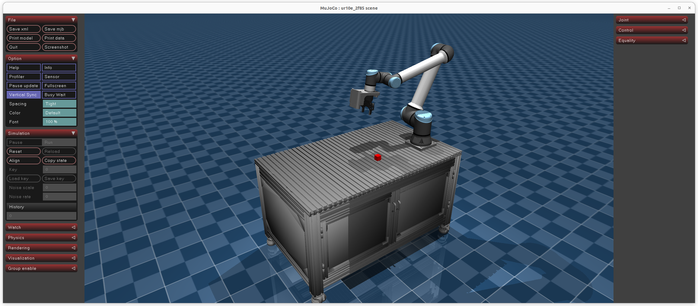
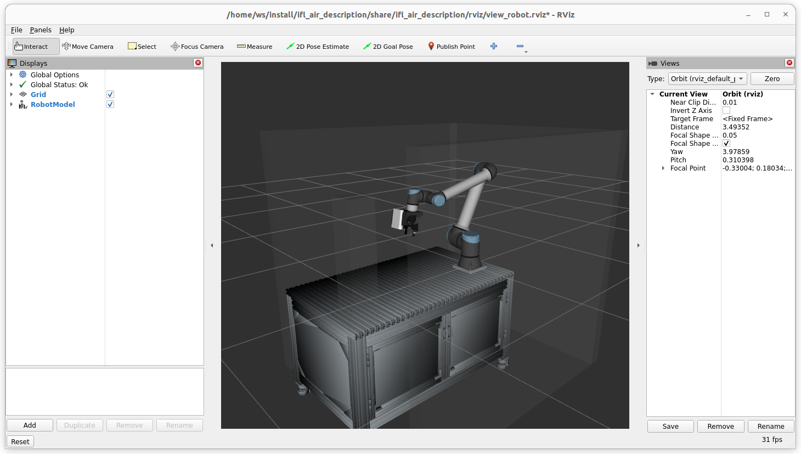

# IFL_AIR_Mujoco_Sim: MuJoCo UR10e + 2F-85 Simulation

This project provides a MuJoCo-based simulation of a UR10e robot with a Robotiq 2F-85 gripper on a table, configurable for both headless and GUI modes. 
The simulation is designed for 

- reinforcement learning (RL) policy interaction 
- provide ROS2 interface similar to real robot setup

and uses Hydra for configuration management.

## Features
- UR10e + 2F-85 gripper simulation in MuJoCo
- Table environment
- Headless or GUI mode (user-configurable)
- RL policy interaction interface
- Configuration via Hydra
- Native ROS2 integration with rclpy (no rosbridge required)

## Getting Started
1. **Install dependencies:**
   - Python 3.8+
   - MuJoCo (mujoco, mujoco-py or mujoco-python)
   - Hydra
   - robosuite, dm_control, or custom URDF/XML for UR10e + 2F-85

   ```bash
   conda deactivate
python3 -m pip install --user -r /home/ws/requirements.txt
   ```

   Make sure to set the MUJOCO_GL environment variable to egl to improve rendering performance, especially if you have a compatible GPU:
   ```bash
   export MUJOCO_GL=egl
   ```

2. **Configure the simulation:**
   - Edit the Hydra config files in `conf/` to set parameters (e.g., headless mode, objects).
   - More details about Objects configuration can be found in [`OBJECTS_README.md`](OBJECTS_README.md).

3. **Run the simulation:**
   - `python main.py` (see config options for headless/GUI)
   - `python main_drive_pattern.py ++sim.scene_dir=models/ur10e_2f85/scene.xml ++sim.control_timestep=0.0005 +motion.period=6.0 +motion.amplitude=0.2 +motion.joint_index=1 +motion.duration=10.0 sim.headless=false`


## Use Simulation in ROS2

To use this simulation as a backend in ROS2, which behaves like a real robot, follow these steps:

0. **Set up your ROS2 workspace:**
   - Make sure you have a ROS2 workspace set up and sourced. This repository is no ROS2 package itself, instead you can run the simulation in a environment where ROS2 is sourced.
   - Its recommended to clone this repository into the `src` folder of your ROS2 workspace and follow the setup instruction above to install the virtual environment and dependencies.

1. **Required ROS2 Packages:**
   - Ensure you have the following ROS2 packages installed in your ROS2 workspace:
      - `robotiq_2f_urcap_adapter`
      - `ifl_air_ur_launch`
      - `ifl_air_description`

2. **Run the simulation:**

   Make sure your ROS2 workspace and your virtual environment are sourced, then run:
   ```bash
   python ros2_main.py
   ```

3. **Launch RVIZ and gripper control interface:**
   - In a new terminal on your ROS2 machine launch this launch file:
   ```bash
   ros2 launch ifl_air_ur_launch cell_small_ur_orbbec_robotiq_mujoco.launch.py
   ```

   You can now control the robot similarly to a real UR10e with Robotiq 2F-85 gripper. For example, you can launch MoveIt to plan and execute motions with the common commands.

### ROS2 Interface Details

The simulation provides the following ROS2 interface:
- **Subscriber:** `/forward_position_controller/commands` (std_msgs/Float64MultiArray) - Direct joint position commands
- **Action Server:** `/scaled_joint_trajectory_controller/follow_joint_trajectory` (control_msgs/FollowJointTrajectory) - Trajectory following
- **Publishers:**
  - `/joint_states` (sensor_msgs/JointState) - Robot state feedback
  - `/{camera_1_name}/image_raw` (sensor_msgs/Image) - camera images at 10Hz
  - `/{camera_2_name}/image_raw` (sensor_msgs/Image) - camera images at 10Hz
  - `/{camera_name}/points` (sensor_msgs/PointCloud2) - RGB-D point clouds in each camera frame
  - `/scene_description` (visualization_msgs/MarkerArray) - Scene objects for visualization
- **Services:**
  - `/reset_sim` (std_srvs/Trigger) - Reset simulation to default configuration
  - `/reset_sim_custom` (std_srvs/Trigger) - Reset with custom end-effector and object poses (see [RESET_SERVICES.md](RESET_SERVICES.md))

Up to two camera names can be defined in the Hydra config file `env/config/base_env.yaml` under `sim.camera_names`. Potential cameras are 

- `camera_orbbec_static`, 
- `camera_orbbec`, 
- `camera_realsense`
- `camera_third_person`
- `camera_side_view`
- `camera_top_view`


Position of camera frames can be adjusted in the MuJoCo XML scene file located at `models/ur10e_2f85/scene.xml`.
Point cloud alignment can be tuned via the `pointcloud_transform` block in `env/config/base_env.yaml`:

```yaml
sim:
  ...
  pointcloud_transform:
    cameras:
      camera_orbbec_static:
        frame: local                   # apply offsets in the camera frame
        translation: [0.0, 0.0, 0.0]
        rpy_deg: [0.0, 0.0, 0.0]
      camera_realsense:
        translation: [0.0, 0.0, 0.0]   # defaults act in the world frame
        rpy_deg: [0.0, 0.0, 0.0]
```

- Camera-specific entries allow fine adjustments; add `frame: local` to rotate/translate around the camera’s own axes.
- Set `sim.enable_pointcloud_camera1/2` to toggle the per-camera RGB-D publishers.
- For troubleshooting performance, enable `sim.pointcloud_profile: true` to log per-stage timings (`project`, `filter`, `serialize`) of the point cloud pipeline (`pointcloud_profile_log_every` controls the report interval).
Point cloud alignment can be tuned via the `pointcloud_transform` block in `env/config/base_env.yaml`. The global entry shifts the entire simulation into the ROS world frame, while camera-specific entries can optionally use `frame: local` to rotate/translate clouds around each camera’s own axes.

#### Reset Services

The simulation supports resetting to default or custom configurations. See [RESET_SERVICES.md](RESET_SERVICES.md) for detailed documentation.

**Quick examples:**
```bash
# Reset to default
ros2 service call /reset_sim std_srvs/srv/Trigger

# Reset with custom configuration
ros2 param set /mujoco_ur10e_interface reset_spec 'string:{"robot": {"joint_positions": [0.0, -1.57, -1.57, -1.57, 1.57, 0.0]}, "objects": {"red_cube": {"position": [-0.8, 0.0, 0.2]}}}'
ros2 service call /reset_sim_custom std_srvs/srv/Trigger
```

**Note:** For multi-line readability, you can also use a parameter YAML file. See [RESET_SERVICES.md](RESET_SERVICES.md) for more examples.

> **_Attention:_** 
> The robot description in the ROS2 workspace may not match the one in the simulation. This is acceptable as long as the joint names are consistent. But collisions may not be accurately represented.
>
> The camera frame still exists in the simulation, but its not part of the collision model. 






## Project Structure
- `main.py` — Entry point for simulation and RL policy interaction
- `conf/` — Hydra configuration files
- `.github/copilot-instructions.md` — Copilot custom instructions

## Notes
- Ensure MuJoCo and the UR10e + 2F-85 model files are available.
- For RL, integrate your policy in `main.py` or via a dedicated interface.

## License
MIT
